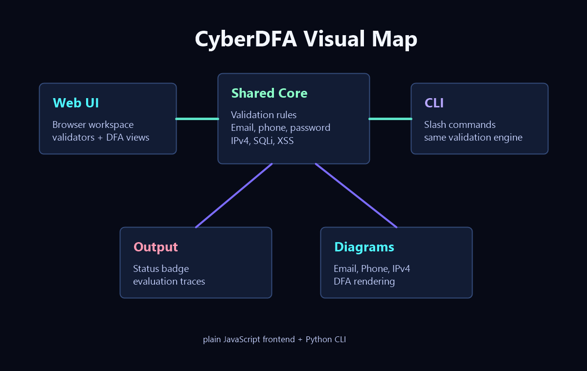

# CyberDFA

A neon-styled DFA and security lab for validating inputs, visualizing flows, and testing simple attack-pattern heuristics.

[](https://cyberseclab-vit.vercel.app)
[](https://www.python.org/)
[](#web-app)
[](#cli)

> Local web app + CLI, sharing the same validation core.

## Hero Banner

```text
   ____      _               ____  _____  _
  / ___|   _| |__   ___ _ __|  _ \|  ___|/ \
 | |  | | | | '_ \ / _ \ '__| | | | |_  / _ \
 | |__| |_| | |_) |  __/ |  | |_| |  _|/ ___ \
  \____\__, |_.__/ \___|_|  |____/|_| /_/   \_\
       |___/

  CyberDFA // finite automata + security checks
```

## Snapshot

| Area | What it gives you |
| --- | --- |
| Web UI | A colorful browser workspace for running checks and viewing DFA diagrams |
| CLI | Slash-command terminal mode with the same validation logic |
| Core logic | Shared Python rules for email, phone, password, IPv4, SQLi, and XSS |
| Diagrams | Built-in DFA views for the automata-based validators |

### Visual Map



## Installation

1. Clone the repository:

   ```bash
   git clone https://github.com/humaidhahm/automata-cyberlab.git
   cd automata-cyberlab
   ```

2. Make sure Python 3.10+ is available.

3. Run the web app:

   ```bash
   python main.py
   ```

4. Or run the CLI:

   ```bash
   python main.py --cli
   ```

5. Open the local URL shown in the terminal for the web app.

<details>
<summary>What makes this different</summary>

- The browser UI and terminal CLI use the same validator engine.
- The interface focuses on DFA visualization, signature detection, and terminal-first workflows.
- The app is dependency-light: plain JavaScript for the browser and Python for local serving/CLI use.

</details>

## What It Checks

| Checker | Behavior | Visual cue |
| --- | --- | --- |
| Email | DFA-style validation with local part, `@`, domain, and TLD transitions | `q0 -> q5` |
| Phone | Exactly 10 digits, one transition per digit | `q0 -> q10` |
| Password | Length, uppercase, lowercase, digit checks, plus estimated brute-force crack time | entropy score |
| IPv4 | Four octets, numeric-only, `0-255`, no leading zeros | dotted octets |
| SQL injection | Signature-based heuristics and quote-balance hints | alert traces |
| XSS | URL-decoded payload scanning for common script indicators | decoded payload |

## Highlights

- Fast client-side checks in plain JavaScript
- Shared Python validation core for the CLI
- Inline rule popups for each checker
- Status badge plus evaluation trace
- DFA diagram panel with fullscreen support
- No frontend framework dependency
- Clean split between presentation, logic, and server entrypoints

## Project Layout

```text
.
|-- main.py          # local server + CLI entrypoint
|-- lab_core.py      # shared validation logic
|-- webapp/
|   |-- index.html   # interface markup
|   |-- styles.css   # visual design
|   `-- app.js       # browser-side logic and DFA rendering
`-- docs/
    `-- visual-map.png
```

## Run Locally

Requirements:

- Python 3.10+

### Web App

```bash
python main.py
```

Then open the URL printed in the terminal, usually `http://127.0.0.1:8000`.

Optional flags:

```bash
python main.py --port 8188
python main.py --host 0.0.0.0
python main.py --no-browser
```

### CLI

```bash
python main.py --cli
```

The CLI supports slash commands, a persistent prompt, and colorized terminal branding.

```bash
/help
/rules password
/diagram email
```

CLI examples:

```bash
/help
/email abc@mail.com
/phone 1234567890
/password StrongPass1
/ipv4 192.168.1.10
/sqli ' OR 1=1 --
/xss <script>alert(1)</script>
/diagram email
/rules password
```

## Usage Flow

1. Enter input in the text box or the CLI prompt.
2. Run a checker from the control panel or by slash command.
3. Read the pass/fail summary and evaluation trace.
4. Open Email, Phone, or IPv4 DFA diagrams when you want the automata view.
5. Click a rendered DFA to expand it fullscreen.

## Deployment

The project is deployed on Vercel:

- https://cyberseclab-vit.vercel.app

## Notes

- The tool is for educational and demo purposes.
- Security detections are signature-based heuristics, not full static or dynamic analysis.
- The CLI and web app share the same core validation rules.

<p align="center">Made with ❤️</p>
